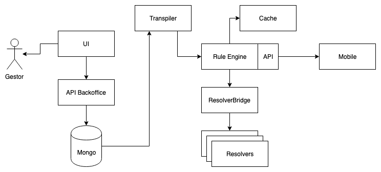

# FeatWS

Mais detalhem em https://bancodobrasil.github.io/featws/

## Premisas

- Liberdade para desenvolvedores e gerentes
- Agilidade
- Núcleo de baixa versão
- Nativo em nuvem
- MultiCloud
- Desempenho
- Resiliência
- Agnóstico
- Código aberto

## Arquitetura

## Repositorios

### [featws-transpiler](https://github.com/bancodobrasil/featws-transpiler) 

Esse projeto é responsavel por traduzir as folhas de regra do cliente web. 

### [featws-ruller](https://github.com/bancodobrasil/featws-ruller)

Após a folha de regra ter sido traduzida, agora temos que avaliá-la, e é isso que o featws-ruller faz.

### [featws-resolver-bridge](https://github.com/bancodobrasil/featws-resolver-bridge)

É uma ponte para acessar resolvedores externos que serão necessários para resolver a folha de regras.

### [featws-resolver-adapter-go](https://github.com/bancodobrasil/featws-resolver-adapter-go)

Uma biblioteca que o resolvedor precisa usar para se conectar ao projeto acima, o featws-resolver-bridge.

### [featws-language-vscode](https://github.com/bancodobrasil/featws-language-vscode) 

A extensão da linguagem featws, no VScode, é baseada nos arquivos .ini, .featws é usada para definir as condições das regras.

### [featws-api](https://github.com/bancodobrasil/featws-api) 

Essa API é responsável por falar diretamente com a interface do usuário, realizando operações CRUD nas folhas de regras.

### [featws-ui](https://github.com/bancodobrasil/featws-ui) 

É a interface do usuário featws, que consumirá os dados da API featws que mostrará ao cliente.

### [js-featws](https://github.com/bancodobrasil/js-featws) 

Um analisador/serializador FeatWS em JavaScript, torna os arquivos .featws legíveis por javascript.

### [grlc](https://github.com/bancodobrasil/grlc) 

O gerador de formato de extensão .grl .

### [featws.tmbundle](https://github.com/bancodobrasil/featws.tmbundle) 

A descrição do idioma .featws .

